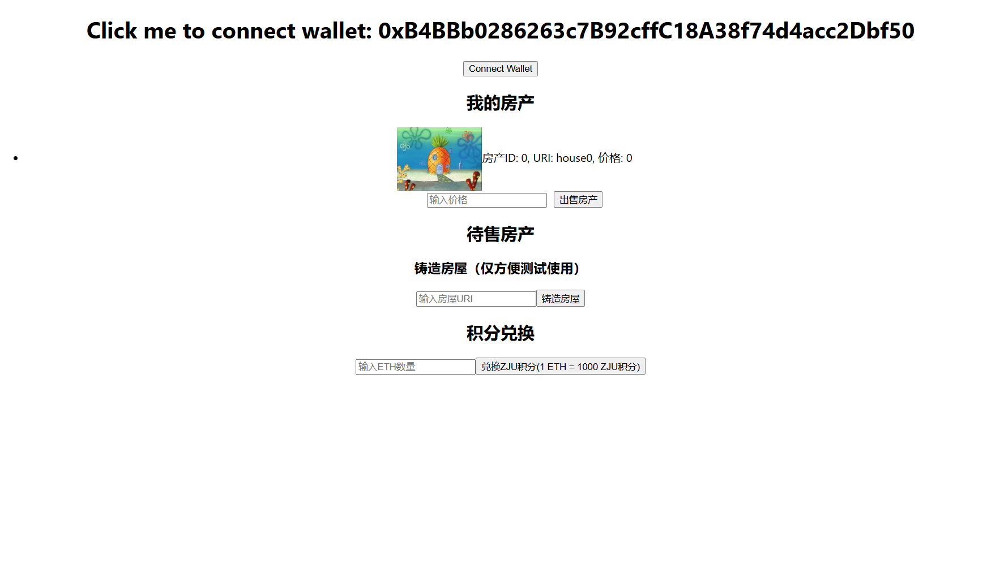
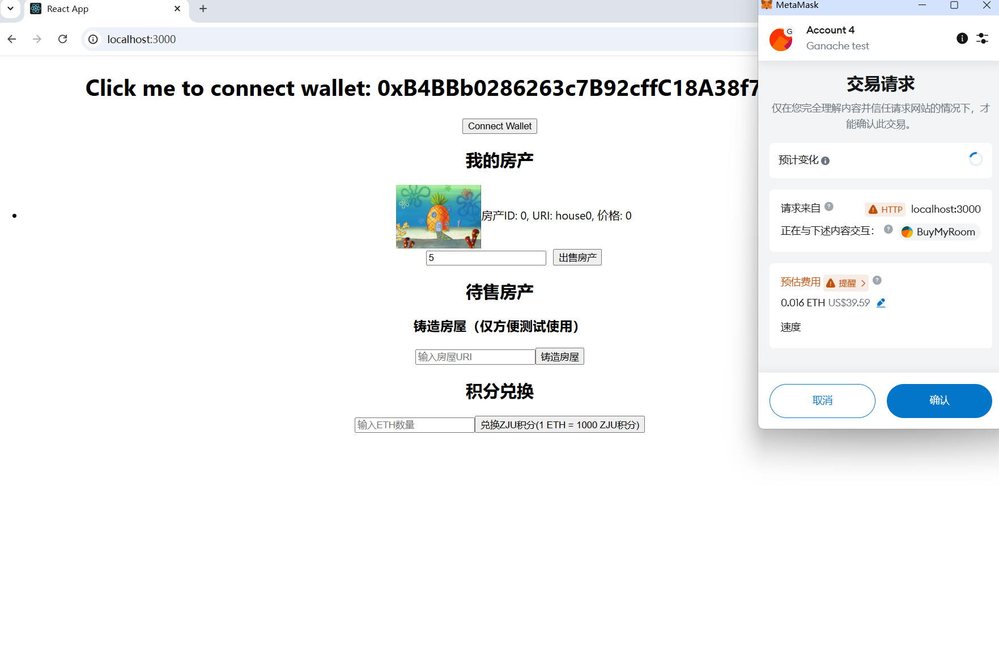
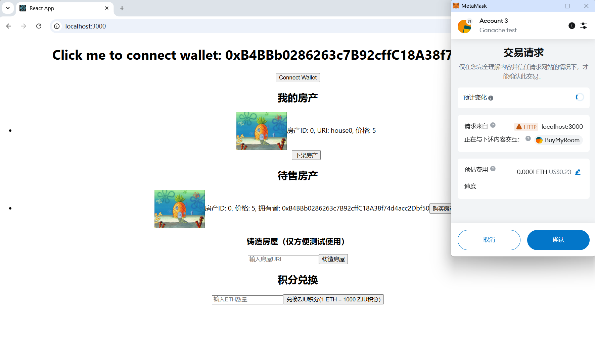
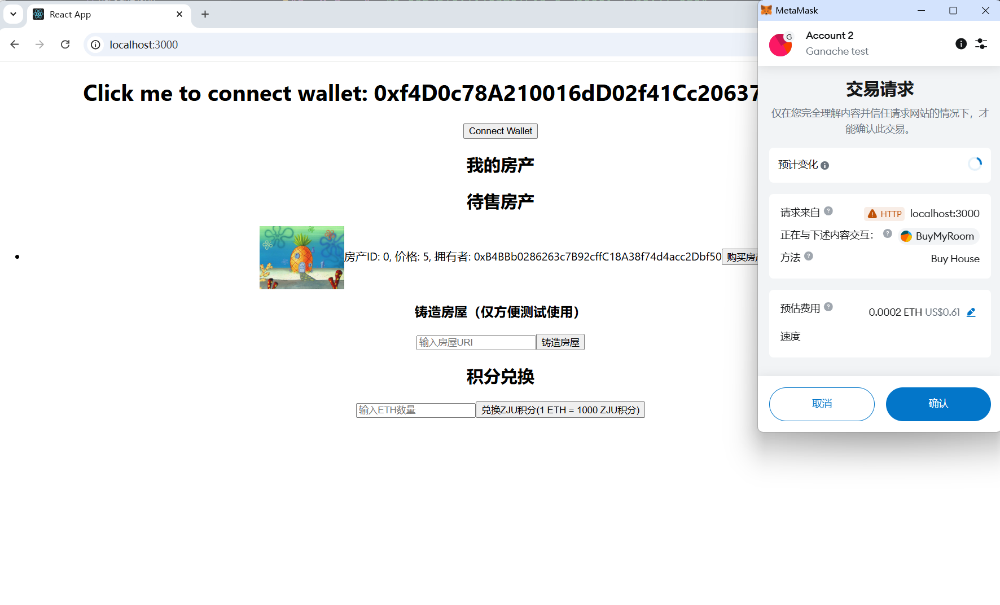
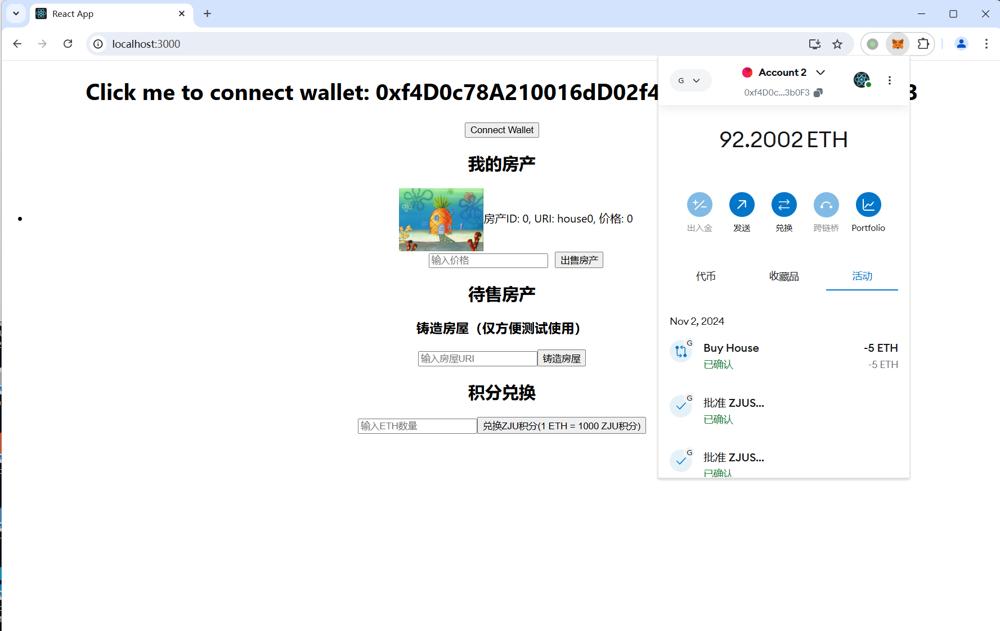
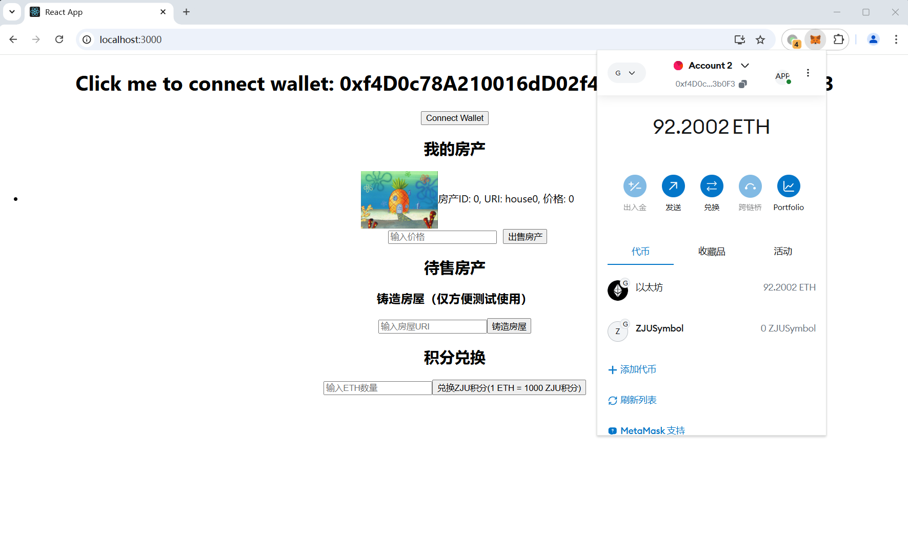
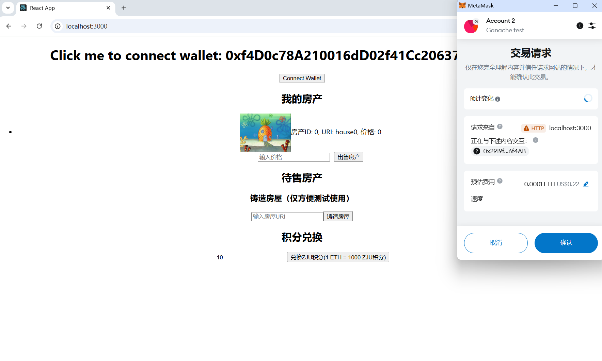
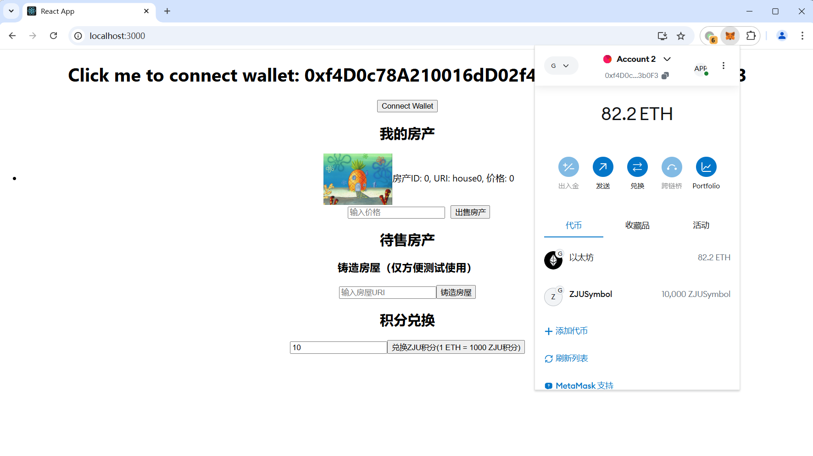

# ZJU-blockchain-course-2024

## 如何运行

补充如何完整运行你的应用。

1. 在本地启动ganache应用。

2. 在 `./contracts` 中安装需要的依赖，运行如下的命令：
    ```bash
    npm install
    ```
3. 在 `./contracts` 中编译合约，运行如下的命令：
    ```bash
    npx hardhat compile
    ```
4. 在 `./contracts` 中运行合约，运行如下的命令：
    ```bash
    npx hardhat run ./scripts/deploy.ts --network ganache
    ```
5. 将生成的ABI文件复制到frontend/src/utils/abis/目录下，并把命令行返回的合约地址复制到frontend/src/utils/contract-addresses.json中
    
6. 在 `./frontend` 中安装需要的依赖，运行如下的命令：
    ```bash
    npm install
    ```
7. 在 `./frontend` 中启动前端程序，运行如下的命令：
    ```bash
    npm run start
    ```

## 功能实现分析

项目完成的功能如下：

1. 房屋的铸造，这个功能是为了方便测试：
合约继承自 ERC721，代表房屋的每个 NFT。构造函数 mintHouse 创建并铸造新房屋 NFT。每个房屋有唯一的 houseId，并使用 houses 映射来存储房屋的信息（包括 ID、URI、所有者、价格和上架时间）。

2. 查看拥有的与出售中的房产列表：
getHouseInfo 函数提供了房屋信息的查询接口，允许前端通过 houseId 获取房屋详情（所有者、URI、价格）

3. 房屋的出售与下架：
listHouseForSale 函数允许房屋所有者指定价格和上架时间，并使用 emit 触发房屋上架事件。
delistHouse 函数通过将价格和上架时间重置为 0 来将房屋下架。

4. 房屋的购买：
buyHouse 函数实现购买上架的房屋。如果买家钱包内的钱大于价格，则会将相应的费用转移给卖家，并将手续费转给合约部署者，并且把房屋转移到卖家账户下。

5. ERC20积分兑换：
在继承自 ERC20 的 MyERC20 中实现，将 ETH 兑换为 ZJU积分。（但是使用积分购买这一功能还没有实现）

## 项目运行截图

1. 整体页面：
2. 用户输入价格并点击房屋出售按钮，在小狐狸中确认后即可上架房屋，房屋会出现在待售房产中：
3. 用户上架房屋后可在我的房产中对应房屋下点击下架按钮，在小狐狸中确认后将对应房屋下架：
4. 切换到另一个用户，在待售房屋中对应房屋下点击购买按钮既即可购买：
5. 在小狐狸中确认后购买完毕，房产转移到自己的账户中，并支付相应的费用：
6. 在积分兑换中输入 ETH 数量可将其兑换为 ZJU积分，兑换前：
7. 在小狐狸中确认后即可兑换：
8. 兑换完成后，账户中的 ZJUSymbol 增加：

## 参考内容

- 课程的参考Demo见：[DEMOs](https://github.com/LBruyne/blockchain-course-demos)。

- 快速实现 ERC721 和 ERC20：[模版](https://wizard.openzeppelin.com/#erc20)。记得安装相关依赖 ``"@openzeppelin/contracts": "^5.0.0"``。

- 如何实现ETH和ERC20的兑换？ [参考讲解](https://www.wtf.academy/en/docs/solidity-103/DEX/)

- ERC721的参考文档：https://ethereum.org/zh/developers/docs/standards/tokens/erc-721/

- 一些 CSDN 、知乎等网站上的回答 
